# Architecture

This document describes the architecture of the customer-churn MLOps pipeline. The system is built around a small set of opinionated choices: **Airflow 2.7.3** for orchestration, **MLflow 2.8.1** for tracking and registry, **DVC 3.30.1** for data and model versioning, **MinIO** (S3 API) for blob storage, **Postgres 14** for both Airflow metadata and the MLflow backend store, and **Kubernetes** for serving.

The goal is not to demonstrate the maximalist ML platform. The goal is to show what an end-to-end pipeline looks like when each component has one job, contracts between stages are explicit, and every artifact (data, code, model, configuration) is versioned and addressable.

---

## 1. System diagram

```mermaid
flowchart LR
    subgraph Sources["Data Sources"]
        CRM[(CRM exports<br/>CSV / Parquet)]
        EVT[(Event stream<br/>Kafka topic)]
        BILL[(Billing snapshots<br/>Postgres CDC)]
    end

    subgraph Ingestion["Ingestion / Raw Layer"]
        ING[Ingestion task<br/>data_pipeline.py]
        RAW[(MinIO: s3://raw/<br/>partitioned by ds)]
    end

    subgraph Features["Feature Engineering"]
        VAL[Schema + quality<br/>validation]
        PRE[Preprocessing<br/>imputation, encoding]
        FS[(Feature store<br/>s3://features/v=N)]
    end

    subgraph Training["Training Layer"]
        TRN[Trainer<br/>4 candidate models]
        EVAL[Evaluator<br/>holdout + CV]
        SEL[Champion selection]
    end

    subgraph Registry["MLflow"]
        TRACK[(Tracking server<br/>Postgres backend)]
        ART[(Artifact store<br/>s3://mlflow/)]
        REG[Model Registry<br/>Staging / Production]
    end

    subgraph Serving["Serving"]
        BATCH[Batch inference<br/>Airflow DAG]
        ONLINE[Online predictor<br/>K8s Deployment]
        PRED[(Predictions<br/>s3://predictions/)]
    end

    subgraph Observability["Observability"]
        PROM[Prometheus]
        GRAF[Grafana]
        DRIFT[Drift detector<br/>KS + JS]
    end

    CRM --> ING
    EVT --> ING
    BILL --> ING
    ING --> RAW
    RAW --> VAL --> PRE --> FS
    FS --> TRN --> EVAL --> SEL
    TRN -.params/metrics.-> TRACK
    SEL -.model.-> ART
    SEL --> REG
    REG --> BATCH
    REG --> ONLINE
    BATCH --> PRED
    ONLINE --> PRED
    ONLINE -.metrics.-> PROM
    BATCH -.metrics.-> PROM
    PRED --> DRIFT
    DRIFT --> PROM
    PROM --> GRAF
```

Three DAGs implement the flow: `data_pipeline`, `training_pipeline`, and `deployment_pipeline`. They are chained via Airflow `TriggerDagRunOperator` rather than a single monolithic DAG so that each can be re-run independently and so that operational failures (e.g. a flaky ingestion source) do not invalidate yesterday's trained model.

---

## 2. Component responsibilities

### 2.1 Feature store (lightweight)

This project does **not** ship Feast or Tecton. The "feature store" is a versioned set of Parquet files in MinIO at `s3://features/v={N}/ds={YYYY-MM-DD}/`. Each version directory contains:

- `features.parquet` — the materialized training/inference matrix
- `schema.json` — column dtypes, nullability, expected ranges
- `stats.json` — count, mean, std, p50/p95/p99, unique cardinality
- `MANIFEST.yaml` — input data hashes, preprocessing code git SHA, DVC pointer

The version `N` increments only when the **logical schema or transformation changes**, not when the data refreshes. Daily refreshes write a new `ds=` partition under the current `v=`. This separation matters: a model trained on `v=3` can be safely retrained against newer `ds=` partitions without code changes, but a `v=4` requires a fresh training run.

If you outgrow this and need point-in-time correctness or low-latency online lookups, swap in Feast with the same MinIO bucket as the offline store. The contract (`features.parquet` + `schema.json`) is stable enough that downstream training code does not change.

### 2.2 MLflow tracking server

Runs as a single K8s `Deployment` (2 replicas behind a `Service`) with:

- **Backend store**: Postgres 14 (`mlflow` database, `mlflow_tracking` schema)
- **Artifact store**: MinIO at `s3://mlflow/artifacts/`
- **Authentication**: basic auth via `MLFLOW_TRACKING_USERNAME` / `MLFLOW_TRACKING_PASSWORD` env vars, wired through a sidecar reverse proxy. MLflow 2.x added native basic auth (`mlflow.server.auth`) in 2.5; we use it but still front it with an Ingress for TLS.

The backend store holds run metadata (params, metrics, tags, lineage). Artifacts (model binaries, plots, evaluation reports) are pushed directly from training pods to MinIO — they never go through the tracking server. This matters at scale: a 200 MB XGBoost model uploaded through the tracking server would block its single Python process. Direct artifact upload uses the `boto3` client and pre-signed URLs are not needed because the worker pods have an `IRSA`-style service account binding.

### 2.3 Model Registry

The Registry uses the same Postgres backend. Stage transitions (None → Staging → Production → Archived) are not just tags — they trigger:

1. A webhook to the deployment DAG (via Airflow REST API).
2. A check that the model has an associated **evaluation report** artifact.
3. A check that promotion gates pass (see `MLFLOW.md`).

We deliberately use stages instead of MLflow 2.9+ aliases for two reasons: stages map cleanly onto the K8s namespaces we already have (`ml-staging`, `ml-serving`), and our promotion script (`scripts/promote-model.sh`) was written against the stage API. If you start a green-field project today, prefer aliases — stages are deprecated as of MLflow 2.9.

### 2.4 Batch inference

The batch path runs as an Airflow DAG on a cron schedule. It pulls the current Production model URI from MLflow (`models:/churn-classifier/Production`), loads the matching feature snapshot, scores it, and writes results to `s3://predictions/{model_version}/{ds}/`. The `{model_version}` in the path is critical: it makes it possible to compare two model versions' predictions on the same `ds` and decide whether a regression is real or a fluctuation.

### 2.5 Online serving

A small FastAPI service wraps the same model artifact and is deployed to the `ml-serving` namespace as a K8s `Deployment` with HPA on CPU. Cold-start cost of loading an XGBoost model is ~400 ms; we mitigate by setting `readinessProbe.initialDelaySeconds=10` and pre-warming with a model load in the container `command`.

Model rollout is **blue/green via two Deployments** (`predictor-blue`, `predictor-green`) behind a single `Service` whose selector is flipped by the deployment DAG. We chose blue/green over Argo Rollouts here to keep the dependency footprint small; Argo Rollouts would be the right choice once you want progressive traffic shifting.

### 2.6 Observability

Prometheus scrapes `/metrics` endpoints on Airflow, MLflow, and the online predictor. Custom metrics are emitted via `prometheus_client` in `src/monitoring/metrics_collector.py`:

| Metric | Type | Labels |
|--------|------|--------|
| `pipeline_runs_total` | Counter | `dag_id`, `status` |
| `pipeline_duration_seconds` | Histogram | `dag_id`, `task_id` |
| `data_quality_score` | Gauge | `dataset`, `check` |
| `model_accuracy` | Gauge | `model_name`, `version` |
| `feature_drift_score` | Gauge | `feature`, `method` |
| `prediction_latency_seconds` | Histogram | `model_version` |

Grafana dashboards live in `monitoring/grafana/dashboards/` and are provisioned via the Grafana sidecar pattern — no manual UI clicks.

---

## 3. Data flow contracts

| Boundary | Format | Schema source of truth | Owner |
|----------|--------|------------------------|-------|
| Sources → raw | CSV / JSON / Parquet | external | upstream teams |
| Raw → features | Parquet | `schema.json` in feature store | data team |
| Features → training | Parquet + schema check | training code asserts schema | ML team |
| Model → registry | MLflow `pyfunc` flavor | MLflow model signature | ML team |
| Registry → serving | `models:/{name}/{stage}` URI | inferred from signature | platform team |

The schema check at the features → training boundary uses `pandera` (declared in `src/data/validation.py`). Mismatches fail the DAG; they do not silently coerce. We learned this the hard way when an upstream rename of `monthly_charges` → `monthly_charge` produced a model that silently treated the column as zero for two weeks.

---

## 4. CI/CD for ML vs traditional CI/CD

Traditional CI/CD has one input (source code) and one output (a binary or container image). ML CI/CD has **four inputs** that can all independently change a deployment:

1. **Code** — preprocessing, training, scoring logic
2. **Data** — distribution shift, label corrections, schema evolution
3. **Hyperparameters** — sweep results, manual overrides
4. **Environment** — library versions (`scikit-learn` 1.3 → 1.4 can change defaults)

Any of those, in any combination, can produce a "new model" even if the others are pinned. The pipeline reflects this:

- **Code changes** trigger the GitHub Actions workflow in `.github/workflows/`: lint, unit tests, integration tests, a smoke training run on a 1 K sample fixture.
- **Data changes** trigger the `data_pipeline` DAG on a cron, which then conditionally triggers `training_pipeline` only when feature drift exceeds `DRIFT_THRESHOLD` or 7 days have elapsed.
- **Hyperparameter changes** are tracked as MLflow runs under a dedicated experiment (`churn-hpo-{date}`); the best run is what gets promoted.
- **Environment changes** are pinned in `requirements.txt` and re-built into the Airflow worker image; an upgrade is a code change.

Where traditional CI/CD ends with "deploy if tests pass", ML CI/CD adds **two extra gates** before a model reaches Production:

| Gate | Threshold | Where |
|------|-----------|-------|
| Offline metric | `f1 >= MIN_F1_SCORE` (0.70) on holdout | `src/training/evaluator.py` |
| Offline regression | `f1` not worse than current Production by `>2%` | `scripts/promote-model.sh` |
| Shadow comparison | predictions agree with current Production on ≥95% of recent batch | deployment DAG |
| Smoke test | online predictor returns 200 on 50 canary requests | `scripts/test-pipeline.sh` |

Only after all four does the K8s `Service` selector flip. This is the practical content of "CD for ML": deployment is gated on *behavior*, not just *successful build*.

---

## 5. Failure-domain boundaries

The architecture intentionally separates blast radii:

- **Postgres for Airflow** and **Postgres for MLflow** are separate databases (same cluster in dev, separate clusters in prod). An Airflow metadata corruption does not lose MLflow lineage.
- **MinIO buckets** are not shared across stages: `raw/`, `features/`, `mlflow/`, `predictions/` each have independent lifecycle policies. We keep `mlflow/` forever, `raw/` for 90 days, `predictions/` for 30 days.
- **K8s namespaces**: `airflow`, `mlflow`, `ml-staging`, `ml-serving`, `monitoring`. NetworkPolicies restrict cross-namespace traffic to the minimum (e.g. `ml-serving` can reach `mlflow` only on port 5000, and only for the registry pull).
- **Service accounts**: each component has its own SA with scoped MinIO credentials via K8s secrets. The trainer SA can read `features/` and `mlflow/`, write `mlflow/`. The serving SA can read `mlflow/` only.

This means a single compromised component (the most common failure mode being a leaked credential in a notebook) cannot corrupt the entire system.

---

## 6. What is intentionally out of scope

To keep the project teachable, these are not included:

- **Feature freshness SLAs** beyond a 24 h batch cadence. Real-time features would require Feast + Redis online store.
- **Multi-region replication** of MinIO and Postgres. Single-region with snapshot backups only.
- **GPU training**. The four candidate models (LogReg, RF, GBM, XGBoost) all train in <5 min on CPU at 10 K samples. GPU would matter at >10 M rows or for deep models.
- **Automated rollback on online metrics**. Rollback is currently a `kubectl rollout undo` triggered by an on-call engineer. Promoting this to an automated control loop is a worthwhile next step but introduces a new failure mode (oscillation) that deserves its own design doc.

---

## 7. Reading order for the rest of the docs

1. `PIPELINE.md` — what each DAG actually does, task by task.
2. `MLFLOW.md` — naming conventions, registry workflow, promotion gates.
3. `DVC.md` — how data versioning fits into the picture and why we use DVC alongside MLflow rather than instead of it.
4. `DEPLOYMENT.md` — running the stack on Kubernetes for real.
5. `TROUBLESHOOTING.md` — when things go sideways.
