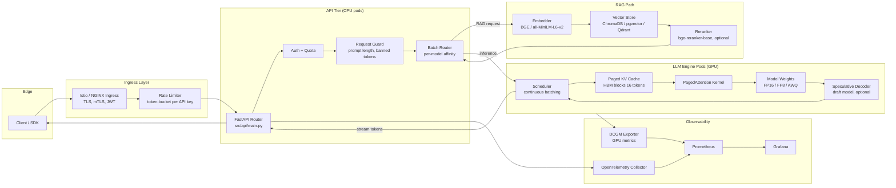

# LLM Deployment Architecture

This document describes the runtime architecture of the LLM serving platform: the components, the data path of a single token, the memory model, and the trade-offs behind the engine choice. It is intended for engineers who will operate or extend the system, not as a marketing overview.

## 1. System Diagram



Solid arrows are request data. The observability fan-out is asynchronous and never on the critical path.

## 2. Components

### 2.1 Ingress

- **Istio sidecar or NGINX Ingress** terminates TLS. mTLS is enabled inside the mesh; clients outside the mesh present a bearer JWT.
- **Rate limiter** is a token-bucket implemented in Envoy (`local_ratelimit` filter) or Redis (`redis-cell`). Enforce two dimensions: requests per minute (60 default, `RATE_LIMIT_RPM`) and tokens per minute per API key. Token limits are more meaningful than request limits because a 4k-prompt request costs >100x a 32-token request.

### 2.2 API tier (`src/api/`)

- Stateless FastAPI pods. Autoscale on CPU (target 60%) because the API layer is purely I/O bound — it forwards prompts and streams Server-Sent Events back.
- The router enforces input validation (max prompt length, banned token IDs), counts tokens with the model's tokenizer to apply quota, and emits a `request_id` propagated as a header into the engine.
- The router does NOT batch; batching is owned by the engine. The router only picks the correct engine pool per model (e.g. `llama-3.1-8b-instruct` vs `llama-3.1-70b-instruct` are different deployments with different pods).

### 2.3 RAG path (`src/rag/`, `src/ingestion/`)

- **Embedder**: bi-encoder served on CPU for small models (all-MiniLM-L6-v2, 384-dim) or on GPU for larger ones (`BAAI/bge-large-en-v1.5`, 1024-dim). Run as a separate deployment so embedding load does not steal HBM from the LLM.
- **Vector store**: ChromaDB by default for the dev path. For >10M vectors, switch to Qdrant or pgvector with HNSW (`m=16`, `ef_construction=200`). Recall@10 should be >0.95 against a labeled eval set before going to production.
- **Reranker**: an optional cross-encoder (`BAAI/bge-reranker-base`) that re-scores the top-K retrieved chunks. Adds ~30 ms but lifts answer quality measurably for technical documentation corpora.

### 2.4 LLM engine

The engine is the hot path and the budget driver. It consists of four subsystems described below.

## 3. Engine Internals

### 3.1 Model loader

Weights are loaded from a **persistent volume backed by a fast tier** (gp3 8000 IOPS, or local NVMe staged via an init container). A cold load of Llama-3.1-70B in FP16 from object storage to HBM dominates pod startup:

| Source                          | 140 GB FP16 load time |
| ------------------------------- | --------------------- |
| S3 → ephemeral disk             | 12-18 min             |
| S3 → local NVMe init container  | 4-6 min               |
| FSx for Lustre → HBM            | 90-120 s              |
| Local NVMe (warm node) → HBM    | 35-50 s               |

This is why `terminationGracePeriodSeconds` and `PodDisruptionBudget` matter so much: you cannot reboot pods casually.

### 3.2 Continuous batching scheduler

Traditional static batching waits for N requests, runs them lockstep, and dispatches together. The slowest sequence holds the entire batch. **Continuous batching** (Orca, 2022; default in vLLM and TGI) interleaves prefill and decode steps so a request that finishes early frees a slot for a new request immediately. Throughput improves 2-5x at p99 latencies that are flat or better.

Scheduler tunables in vLLM:

- `max_num_seqs` — concurrency cap. Increasing this raises throughput but increases queue depth and time-between-tokens. Start at 256 for 8B FP16 on an H100.
- `max_num_batched_tokens` — total tokens (prefill + decode) per forward pass. Default tends to be conservative; on H100 you can push 8192-16384.
- `enable_chunked_prefill` — splits long prompts across steps so a 32k-token prompt does not freeze all decoders for seconds. **Turn this on.**

### 3.3 KV cache and PagedAttention

The KV cache stores the key and value tensors of every attended token in every layer for every active sequence. It dominates HBM usage at inference and is the variable nobody intuits correctly the first time.

**Per-token KV cache size formula:**

```
bytes_per_token = 2 (K and V)
               × num_layers
               × num_kv_heads
               × head_dim
               × dtype_bytes
```

For Llama-3.1-8B (32 layers, 8 KV heads via GQA, head_dim 128, FP16):

```
2 × 32 × 8 × 128 × 2 = 131,072 bytes = 128 KiB per token
```

A 4096-token sequence consumes 4096 × 128 KiB = **512 MiB** of KV cache. 256 concurrent 4k-token sequences = **128 GiB** — already overflowing an 80 GB H100.

For Llama-3.1-70B (80 layers, 8 KV heads, head_dim 128, FP16):

```
2 × 80 × 8 × 128 × 2 = 327,680 bytes = 320 KiB per token
```

A 4096-token sequence: 1.28 GiB. 32 concurrent 4k sequences fill 40 GiB beyond model weights.

**PagedAttention** (vLLM, Kwon et al. 2023) divides the cache into fixed-size blocks (16 tokens default) and uses a page table per sequence, exactly like an OS virtual memory system. This eliminates external fragmentation (you only ever waste up to `block_size - 1` tokens per sequence, not the full `max_model_len`), enables true KV sharing for prefix caching and beam search, and lifts effective batch sizes 2-4x. **Prefix caching** (`enable_prefix_caching=True`) automatically deduplicates shared system prompts and chat-history prefixes — a free 30-60% throughput win for chat workloads.

### 3.4 Request router (in-engine)

The engine receives requests, classifies them by stage (prefill vs decode), and assigns them to a batch slot. Two router-level decisions matter:

- **Priority**: gives latency-sensitive streaming traffic precedence over batch async traffic. Implement by separating engine pools rather than priority queues — mixing both on one engine produces a head-of-line blocking pattern that obliterates p99.
- **Prefill/decode disaggregation** (DistServe, vLLM 0.6+, NVIDIA Dynamo): run prefill on one set of GPUs and decode on another. Prefill is compute-bound, decode is memory-bandwidth-bound, and they fight for the same SMs. Splitting them lifts goodput 30-100% but doubles cluster complexity. Start integrated; disaggregate only when you have measured a need.

## 4. Engine Trade-Off Matrix

| Property                                | **vLLM 0.6+**         | **NVIDIA Triton + TensorRT-LLM** | **HuggingFace TGI 2.x** |
| --------------------------------------- | --------------------- | -------------------------------- | ----------------------- |
| Continuous batching                     | Yes (origin)          | Yes (in-flight batching)         | Yes                     |
| PagedAttention                          | Yes (origin)          | Yes (paged KV)                   | Yes (`paged-attn`)      |
| Prefix caching                          | Built-in              | Manual via `kv_cache_reuse`      | Built-in                |
| Speculative decoding                    | Yes (draft + n-gram)  | Yes (Medusa, EAGLE)              | Yes (Medusa)            |
| Quantization (AWQ/GPTQ/FP8/INT8)        | Yes (broad)           | Best-in-class (FP8 on Hopper)    | Yes                     |
| Multi-LoRA                              | Yes (S-LoRA)          | Yes                              | Yes                     |
| Streaming SSE                           | Yes (OpenAI-compat)   | Custom                           | Yes                     |
| Throughput on H100 (Llama-3-8B, FP16)   | ~5400 tok/s aggregate | ~6500 tok/s aggregate (FP8)      | ~4200 tok/s             |
| Operational complexity                  | Low                   | High (engine build per shape)    | Medium                  |
| License                                 | Apache 2.0            | NVIDIA EULA                      | Apache 2.0 (HFOIL on TGI ≥2.0 for hosted) |
| Multi-vendor (AMD, Intel, TPU)          | Partial (ROCm)        | NVIDIA only                      | Partial                 |

**Heuristic:**

- Start with **vLLM** for >90% of workloads. It is the default for a reason.
- Move to **TensorRT-LLM via Triton** when you need maximum FP8 throughput on Hopper, are vendor-locked to NVIDIA, and have the staff to maintain per-shape engine builds.
- Use **TGI** if you are deeply in the HF ecosystem and want the smoothest path from a HF model card to a serving endpoint. Be aware of the HFOIL clauses if you intend to resell.

## 5. Memory Budget Worksheet

For a single 80 GB H100 running Llama-3.1-8B in FP16:

| Bucket                                                       | Bytes  |
| ------------------------------------------------------------ | ------ |
| Model weights (8B × 2 bytes)                                 | 16 GiB |
| CUDA + driver + cuBLAS workspace                             | 2 GiB  |
| Activation / forward-pass scratch (`gpu_memory_utilization`) | 4 GiB  |
| **Available for KV cache**                                   | 58 GiB |
| → tokens at 128 KiB/token                                    | ~475 k |
| → concurrent 4k-token sequences                              | ~115   |

For Llama-3.1-70B FP16, the model alone (~140 GiB) does not fit on one H100. Required configurations:

- **TP=2** across NVLink-connected H100s (180 GiB total): fits, ~40 GiB KV budget.
- **TP=4**: fits comfortably, ~200 GiB KV budget, doubles per-request latency from extra all-reduce.
- **FP8 on a single H100** (~70 GiB weights): fits with ~10 GiB KV — only viable for batch=1 demos.
- **AWQ INT4** (~35-40 GiB weights): fits on one H100, ~40 GiB KV. Production-grade for 70B.

For Llama-3.1-405B, FP16 weights are ~810 GiB. Realistic deployments use FP8 (~405 GiB, fits on one HGX H100 8×80 with TP=8) or FP4 (~200 GiB, fits on TP=4 H100s).

## 6. Failure-Tolerance Properties

- **Stateless API tier**: any pod can serve any request; rolling updates are zero-downtime.
- **Engine pods are stateful in HBM only**: a crash loses in-flight sequences (clients must retry idempotently). The model weights are recoverable from PV without re-downloading.
- **Vector store** is the only persistent component in this stack; back it up. ChromaDB has no built-in replication — for production use Qdrant (Raft) or pgvector (Postgres HA).
- **Spot/preemptible engine pods** are viable for batch inference paths only. Live serving pools should be on-demand or reserved; mix in spot via a separate `priorityClass`.

## 7. References and Further Reading

- Kwon et al., "Efficient Memory Management for Large Language Model Serving with PagedAttention", SOSP 2023.
- Yu et al., "Orca: A Distributed Serving System for Transformer-Based Generative Models", OSDI 2022.
- Zhong et al., "DistServe: Disaggregating Prefill and Decoding for Goodput-Optimized LLM Serving", OSDI 2024.
- Frantar et al., "GPTQ" (2022); Lin et al., "AWQ" (2023).
- NVIDIA, "TensorRT-LLM Best Practices for FP8 Inference on Hopper" (2024).
- Internal companion docs: [OPTIMIZATION.md](OPTIMIZATION.md), [GPU.md](GPU.md), [COST.md](COST.md).
